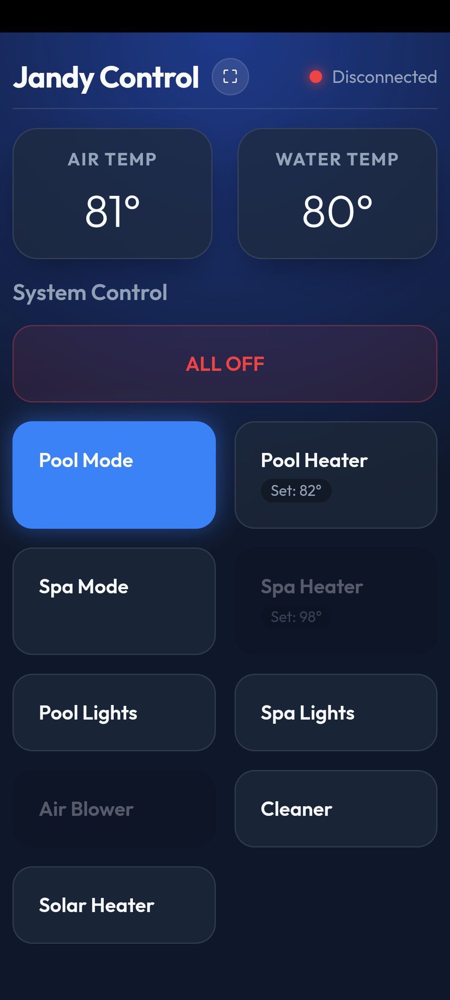

# Jandy RS-485 Controller & Web App

<p align="center">
  
</p>

A Python library and web dashboard for controlling Jandy / Pentair Aqualink pool and spa systems over RS-485. 

The system works by spoofing a Jandy PDA Handheld Remote (`0x60`). It runs a background thread that communicates with the Master Controller, reading the screen buffer and cursor position to keep track of menu states and equipment status.

## Features

### Web App
- **Mobile UI:** Clean, responsive interface designed for phones.
- **PWA Support:** Can be added to your home screen to run in full-screen mode like a native app.
- **Hardware Sync:** The UI automatically updates to match the physical equipment state (e.g., if someone turns on the spa using the physical remote outside, the web app updates).
- **Configurable:** Uses `config.yaml` to hide or show buttons depending on your specific pool setup.

### Python API
- **Status Polling:** Parses `CMD_JXI_PING` broadcasts to get real-time water temps and heater setpoints without navigating menus.
- **Screen Scraping:** Reads equipment status (Pool Mode, Spa Mode, etc.) directly from the screen buffer in the background.
- **State Tracking:** Keeps track of the menu cursor and equipment state so it won't accidentally toggle something off if it's already on.
- **Menu Wrapping:** Scrolls UP to reach items at the bottom of the menu (like `ALL OFF`) instead of pressing DOWN 15 times.
- **Safety Interlocks:** Aborts commands if the Jandy system is in a transitional state (`***`), and prevents heaters from turning on if the main pump is off.

## Hardware Requirements

- Any Linux-based machine (Raspberry Pi, etc.)
- A USB to RS-485 Serial Adapter (e.g., FTDI chipset)
- A physical connection to the red, black, yellow, and green wires of the Aqualink RS-485 bus.

## Quickstart

### Installation

This project uses [uv](https://github.com/astral-sh/uv), an extremely fast Python package manager.

1. **Clone the Repository**:
```bash
git clone https://github.com/YOUR_USERNAME/jandy-controller.git
cd jandy-controller
```

2. **Install `uv`**:
```bash
curl -LsSf https://astral.sh/uv/install.sh | sh
```

3. **Configure your Hardware**:
Copy the example configuration file:
```bash
cp config.example.yaml config.yaml
```
Then open `config.yaml` to specify your serial port connection and toggle the hardware installed at your pool. 

```yaml
system:
  serial_port: "/dev/ttyUSB0"
  enable_logging: false

hardware:
  has_spa: true
  has_cleaner: true
  # ...
```

> [!TIP]
> **Finding your Serial Port on a Raspberry Pi / Linux**
> - **USB Adapters:** If you aren't sure what your USB adapter is called, plug it into your machine and run `ls /dev/ttyUSB* /dev/ttyACM*`. It will almost always show up as `/dev/ttyUSB0`. You can also run `dmesg | tail -n 20` immediately after plugging it in to see the exact device name.
> - **GPIO (Built-in) Serial:** If you are using an RS-485 HAT or wiring directly to the Raspberry Pi's built-in GPIO pins (Pins 8 & 10), your serial port will typically be `/dev/serial0` (which automatically maps to `ttyS0` or `ttyAMA0`). You may need to enable the serial port using `sudo raspi-config` first!

4. **Run the Server**:
The system includes a fully mobile-responsive Progressive Web App (PWA) dashboard. To run it continuously in the background, we recommend using `screen` or `tmux`.

**Using `screen`**:
```bash
# Start a new screen session
screen -S jandy

# Run the web server using uv
uv run uvicorn web:app --host 0.0.0.0 --port 8000

# To detach and leave it running, press: Ctrl+A, then D
# To reattach later, run: screen -r jandy
```

**Using `tmux`**:
```bash
# Start a new tmux session
tmux new -s jandy

# Run the web server using uv
uv run uvicorn web:app --host 0.0.0.0 --port 8000

# To detach and leave it running, press: Ctrl+B, then D
# To reattach later, run: tmux attach -t jandy
```

5. **Start on Boot (Optional)**:
To have the controller start automatically when your machine reboots, you can add a cron job. 

Run `crontab -e` and add **one** of the following lines to the bottom of the file. Be sure to replace `/path/to/jandy-controller` with the actual path to your repository.

**Using `screen`**:
```bash
@reboot cd /path/to/jandy-controller && screen -dmS jandy uv run uvicorn web:app --host 0.0.0.0 --port 8000
```

**Using `tmux`**:
```bash
@reboot cd /path/to/jandy-controller && tmux new-session -d -s jandy 'uv run uvicorn web:app --host 0.0.0.0 --port 8000'
```

*Note: `cron` environments do not load your normal terminal variables. If the script fails to run on boot, you may need to provide the absolute path to `uv` (e.g., `~/.local/bin/uv` or `~/.cargo/bin/uv`).*

## Available API Methods

All methods automatically navigate the Jandy PDA menu structure, find the correct item, verify its current state, toggle it if necessary, and cleanly return to the Home Menu.

- `api.pool_mode(state: bool)`
- `api.spa_mode(state: bool)`
- `api.pool_heat(state: bool, temp: int = None)`
- `api.spa_heat(state: bool, temp: int = None)`
- `api.pool_lights(state: bool)`
- `api.spa_lights(state: bool)`
- `api.air_blower(state: bool)`
- `api.solar(state: bool)`
- `api.all_off()`
- `api.get_status() -> dict`

## Project Structure

- `jandy/` - The core Python package containing the `JandyController` and RS-485 decoding logic.
- `test_api.py` - A comprehensive test harness to demonstrate and validate the API.
- `jandy-rs485-protocol.md` - Extensive, newly-updated documentation detailing the exact bytes, commands, and secrets of the Jandy RS-485 protocol.
